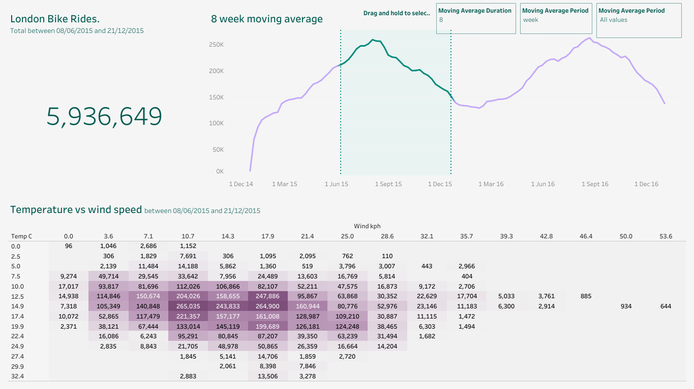

# London Bike Share Analysis: Exploring bike-sharing demand in relation to weather factors and daily patterns

# Overview  
The goal of this analysis is to determine and evaluate the key factors associated with bike share ride volume.  
I analyzed historical bike-sharing data from Kaggle: [London bike sharing dataset](https://www.kaggle.com/datasets/hmavrodiev/london-bike-sharing-dataset) to explore how factors like weather, time of day, season, and day type affect ride volume.

## Interactive Tableau Dashboard
You can explore the interactive dashboard here:
[Click to view on Tableau Public](https://public.tableau.com/shared/WGZJJX8Z4?:display_count=n&:origin=viz_share_link)

