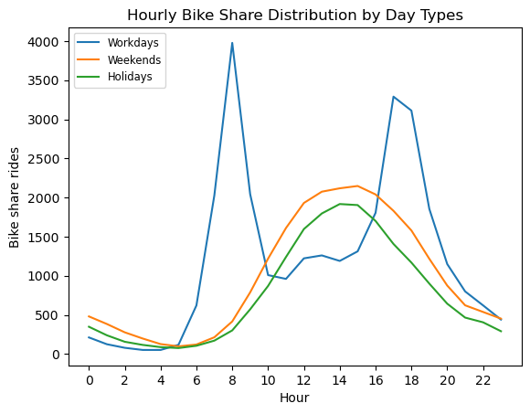
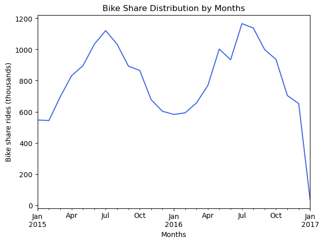
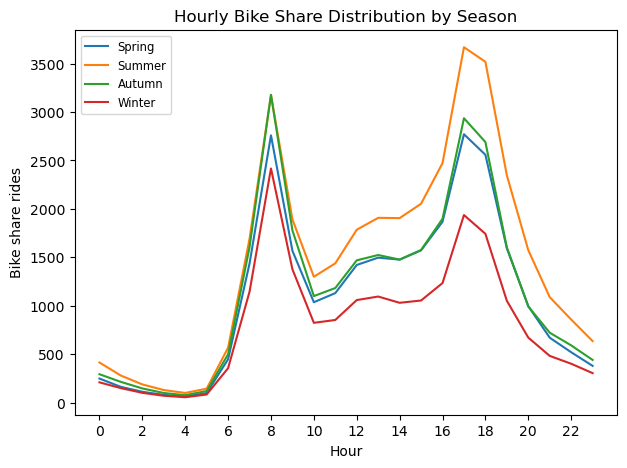
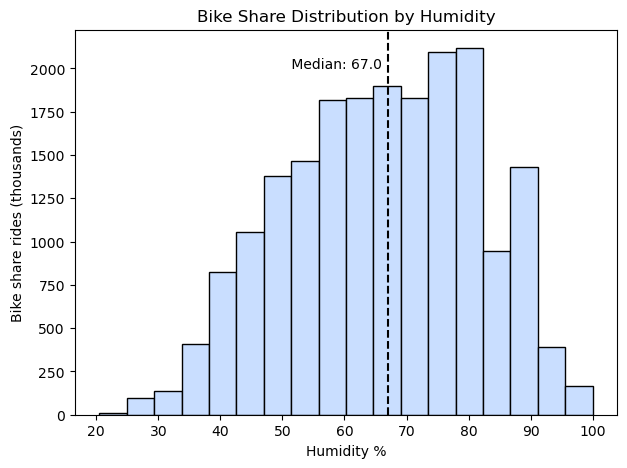

# London Bike Share Analysis: Exploring bike-sharing demand in relation to weather factors and daily patterns

## Project Overview  
The goal of this analysis is to determine and evaluate the key factors associated with bike share ride volume.  
  
I analyzed historical bike-sharing data from Kaggle: [London Bike Sharing Dataset](https://www.kaggle.com/datasets/hmavrodiev/london-bike-sharing-dataset) to explore how factors like weather, time of day, season, and day type affect ride volume.

This dataset includes over 17,000 hourly records of bike rentals, with features such as:
- **Timestamp-based data** (date, working day, holiday)
- **Weather conditions** (temperature, temperature "feels like", humidity, wind speed, weather category, season)
- **Ride count** (the count of new bike shares)  
  
I chose this dataset because it offers temporal and environmental variables, which are ideal for exploring real-world patterns in transportation behavior and building practical, data-driven insights.

## Tools & Technologies
- **Python** (pandas, matplotlib, numpy, seaborn, scipy)
- **Jupiter Notebook** for code development and narrative
- **Tableau** for dashboard creation
- **Data Sourse**: [Bike Sharing Dataset on Kaggle](https://www.kaggle.com/datasets/hmavrodiev/london-bike-sharing-dataset)

## Methodology
1. **Data Cleaning**
   - Used bike-sharing dataset from [Kaggle](https://www.kaggle.com/datasets/hmavrodiev/london-bike-sharing-dataset)
   - Performed missing values checks, corrected data types, engineered features
2. **Exploratory Data Analysis (EDA)**
   - Visualized distributions and relationships between variables using histograms, KDEs, Q-Q plots
   - Analyzed ride frequency across seasons, weekdays, hours and weather conditions
4. **Statistical Testing**
   - Applied correlation analysis (Pearson & Spearman)
   - Used ANOVA, Kruskal_wallis, Mann-Whitney U test for group comparison
   - Performed assumption testing where applicable (normality, skewness)
6. **Visualization & Interpretation**
   - Developed interactive dashboard using Tableau
   - Interpreted technical results and translated them into business-relevant insights
8. **Documentation & Communication**
   - Summarised both analytical and business insights

## Analytical Insights
- **Pearson correlation** analysis revealed moderate assosiations between bike ride count and weather/time variables:
  - Negative correlation with **humidity**: more rides in drier conditions
  - Positive correlation with **temperature**: more rides in warmer weather
  - Hour cosine correlation showed strong cyclic patterns, especially on non-working days
    
- **One-way ANOVA** and post-hoc Tukey test showed significant differences in ride frequency across **seasons**, with exception of spring and autumn that are statistically similar
- **Mann-Whitney U test** confirmed that **workdays and non-workdays** have different usage patterns
- **Kruskal-Wallis and Dunn's test** showed significant ride count differences across **weather** categories
- **Descriptive and EDA** findings included:
  - Right-skewed overall ride distribution
  - **Seasonal peaks** (e.g., July) and dips (e.g., January)
    
  - **Hourly** variations across day types and seasons
    
  - Left-skewed distributions across weather categories

## Business insights
- **Rider behavior is weather-sensitive**, but high-humidity ride counts suggest a subset of committed users (e.g., commuters). This supports maintaining full service during humid periods and exploring user segmentation.
  
- **Hourly patterns** show commute-realted peaks on workdays and midday peaks on weekends/holidays. This can guide staffing, bike redistribution, and targeted promotions.
- **Seasonal trends** such as higher evening usage in summer and morning in winter, suggest the need for seasonally adaptive availability and marketing strategies.
- **Monthly ride trends** indicate predictable seasonal usage variations. Operators can optimize maintenance and promotional efforts around low-demand months like January.
- **Wind speed trends** reflect increase in rides with wind speed until a subtle dip. Understanding this can improve weather-adjusted demand models.
- Overall, the analysis supports **context-specific planning over generalized strategies**, enhancing both service reliability and user satisfaction.

## Interactive Tableau Dashboard
You can explore the interactive dashboard here:
[Click to view on Tableau Public](https://public.tableau.com/shared/WGZJJX8Z4?:display_count=n&:origin=viz_share_link)

